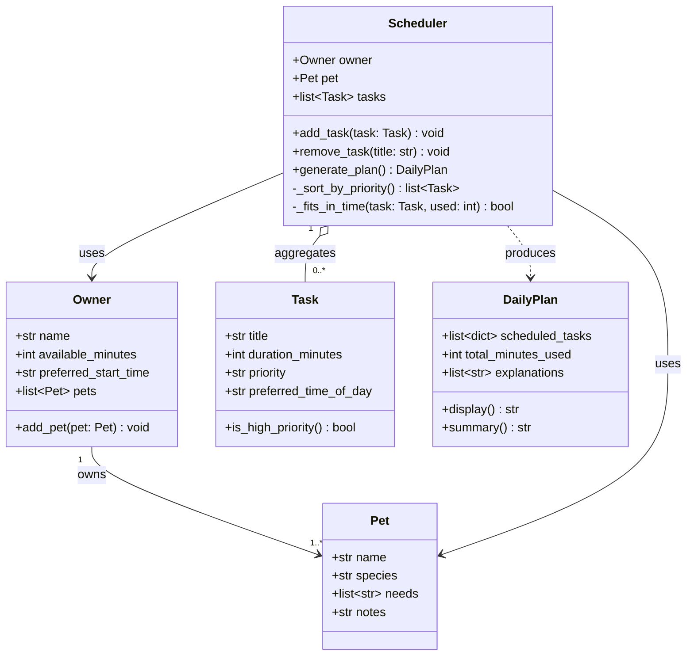

```mermaid
classDiagram
    class Owner {
        +str name
        +int available_minutes
        +str preferred_start_time
        +list~Pet~ pets
        +add_pet(pet: Pet) void
    }

    class Pet {
        +str name
        +str species
        +list~str~ needs
        +str notes
    }

    class Task {
        +str title
        +int duration_minutes
        +str priority
        +str preferred_time_of_day
        +is_high_priority() bool
    }

    class Scheduler {
        +Owner owner
        +Pet pet
        +list~Task~ tasks
        +add_task(task: Task) void
        +remove_task(title: str) void
        +generate_plan() DailyPlan
        -_sort_by_priority() list~Task~
        -_fits_in_time(task: Task, used: int) bool
    }

    class DailyPlan {
        +list~dict~ scheduled_tasks
        +int total_minutes_used
        +list~str~ explanations
        +display() str
        +summary() str
    }

    Owner "1" --> "1..*" Pet : owns
    Scheduler --> Owner : uses
    Scheduler --> Pet : uses
    Scheduler "1" o-- "0..*" Task : aggregates
    Scheduler ..> DailyPlan : produces
```
