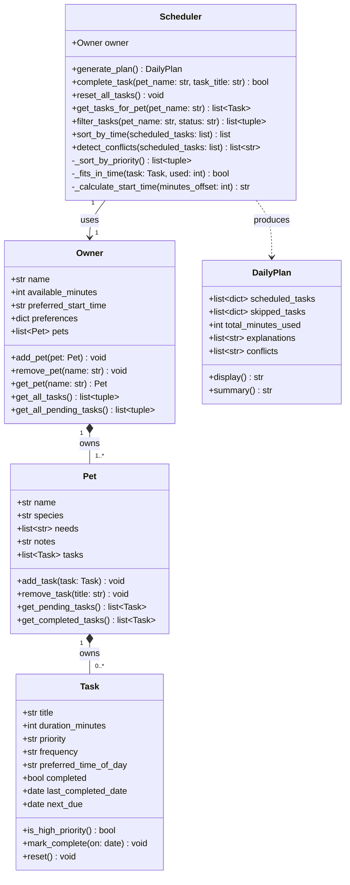

```mermaid
classDiagram
    class Owner {
        +str name
        +int available_minutes
        +str preferred_start_time
        +dict preferences
        +list~Pet~ pets
        +add_pet(pet: Pet) void
        +remove_pet(name: str) void
        +get_pet(name: str) Pet
        +get_all_tasks() list~tuple~
        +get_all_pending_tasks() list~tuple~
    }

    class Pet {
        +str name
        +str species
        +list~str~ needs
        +str notes
        +list~Task~ tasks
        +add_task(task: Task) void
        +remove_task(title: str) void
        +get_pending_tasks() list~Task~
        +get_completed_tasks() list~Task~
    }

    class Task {
        +str title
        +int duration_minutes
        +str priority
        +str frequency
        +str preferred_time_of_day
        +bool completed
        +date last_completed_date
        +date next_due
        +is_high_priority() bool
        +mark_complete(on: date) void
        +reset() void
    }

    class Scheduler {
        +Owner owner
        +generate_plan() DailyPlan
        +complete_task(pet_name: str, task_title: str) bool
        +reset_all_tasks() void
        +get_tasks_for_pet(pet_name: str) list~Task~
        +filter_tasks(pet_name: str, status: str) list~tuple~
        +sort_by_time(scheduled_tasks: list) list
        +detect_conflicts(scheduled_tasks: list) list~str~
        -_sort_by_priority() list~tuple~
        -_fits_in_time(task: Task, used: int) bool
        -_calculate_start_time(minutes_offset: int) str
    }

    class DailyPlan {
        +list~dict~ scheduled_tasks
        +list~dict~ skipped_tasks
        +int total_minutes_used
        +list~str~ explanations
        +list~str~ conflicts
        +display() str
        +summary() str
    }

    Owner "1" *-- "1..*" Pet : owns
    Pet "1" *-- "0..*" Task : owns
    Scheduler "1" --> "1" Owner : uses
    Scheduler ..> DailyPlan : produces
```
